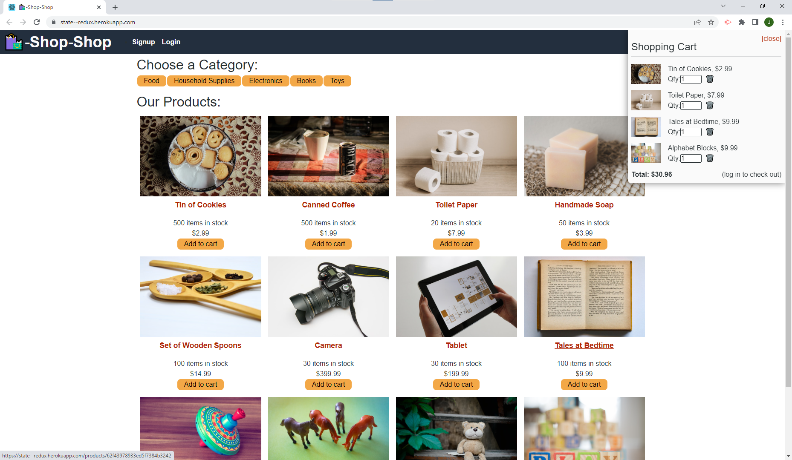

# State Redux-Store Shop 

## Description

### What does State Redux-Store Shop do?

This is a refactored react app to use Redux and Store to manage state.


## Table of Contents

- [Installation](#installation)
- [Usage](#usage)
- [Credits](#credits)
- [Contribution](#contribution)
- [Questions](#questions)
- [Licence](#licence)

---

## Installation 

### Technologies Used in Development

Technologies used include:


### Installation Instructions

```md
Visit on Heroku!
```

## Usage



```md

```

## Credits

Bootcamp provided the majority of the code. Most of the changes are on client side components and utils folders.

## Contribution

Guidelines for contribution:

no contribution necessary

## Questions

No contact

https://github.com/jq67


---
## Licence
This project is covered under the `Mit License`